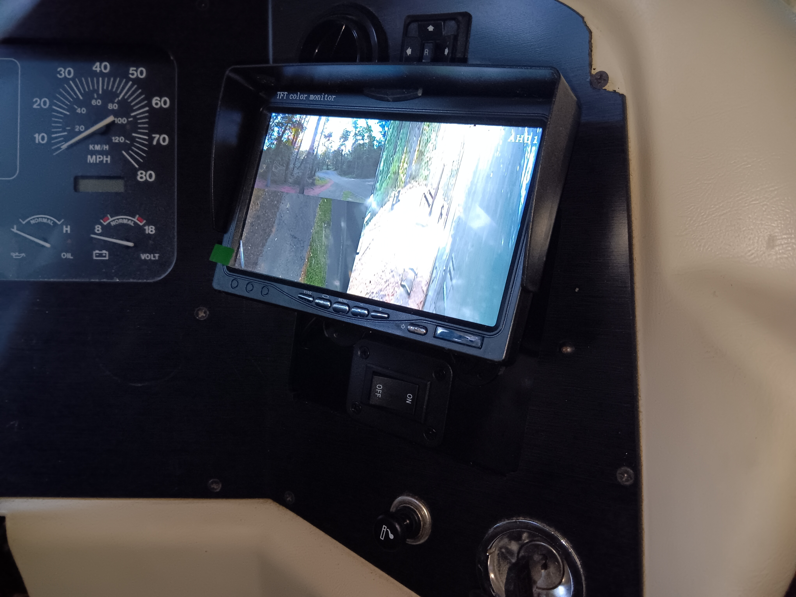
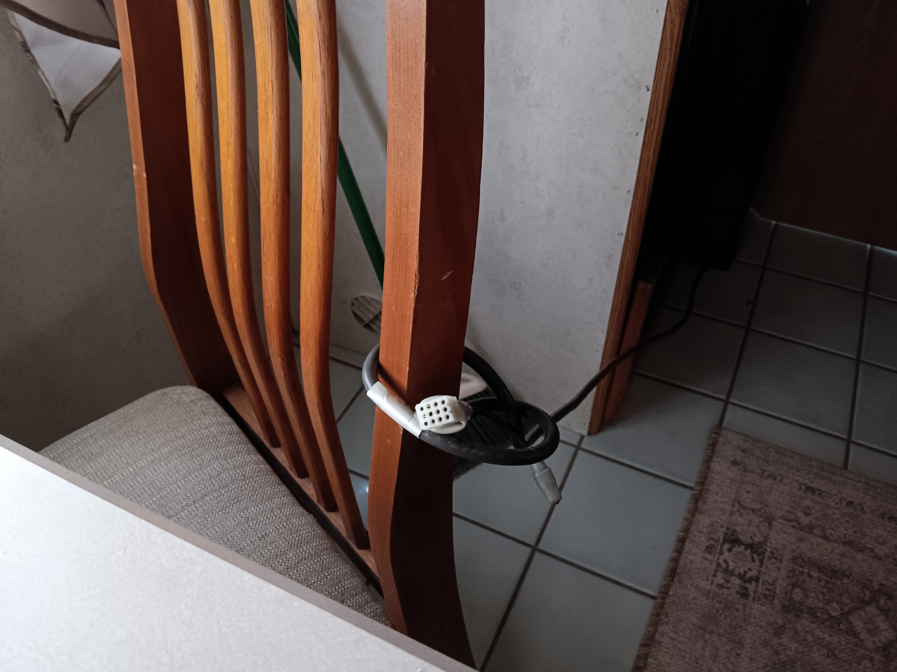
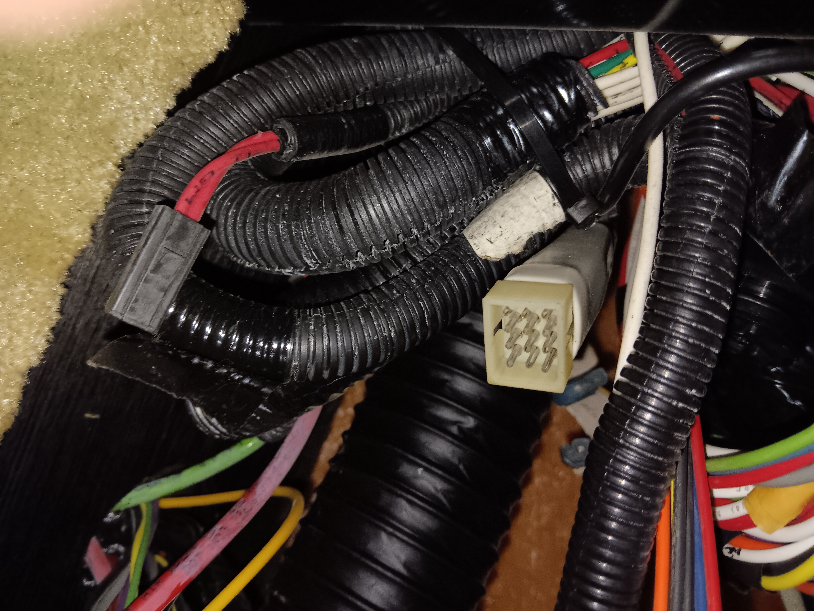
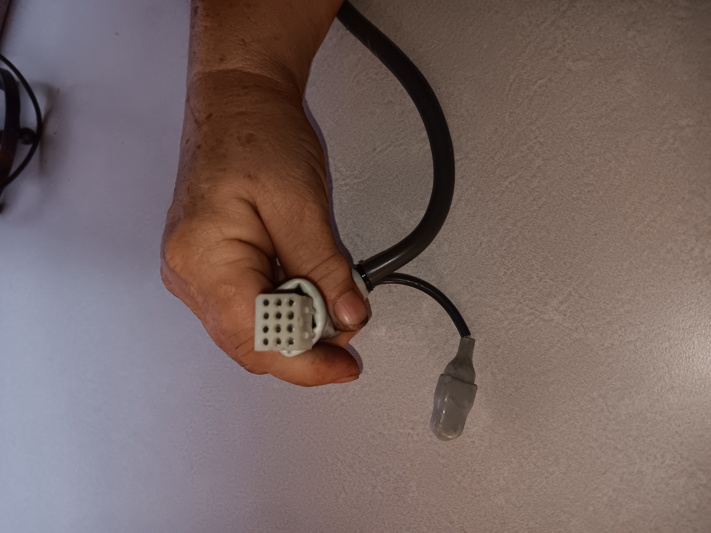
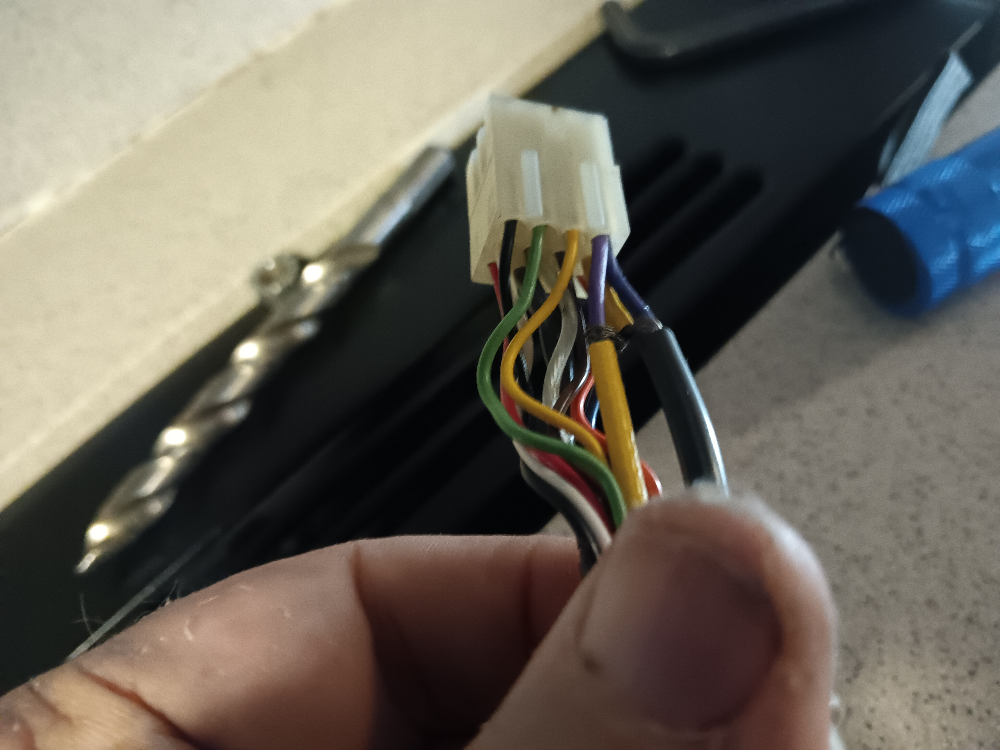
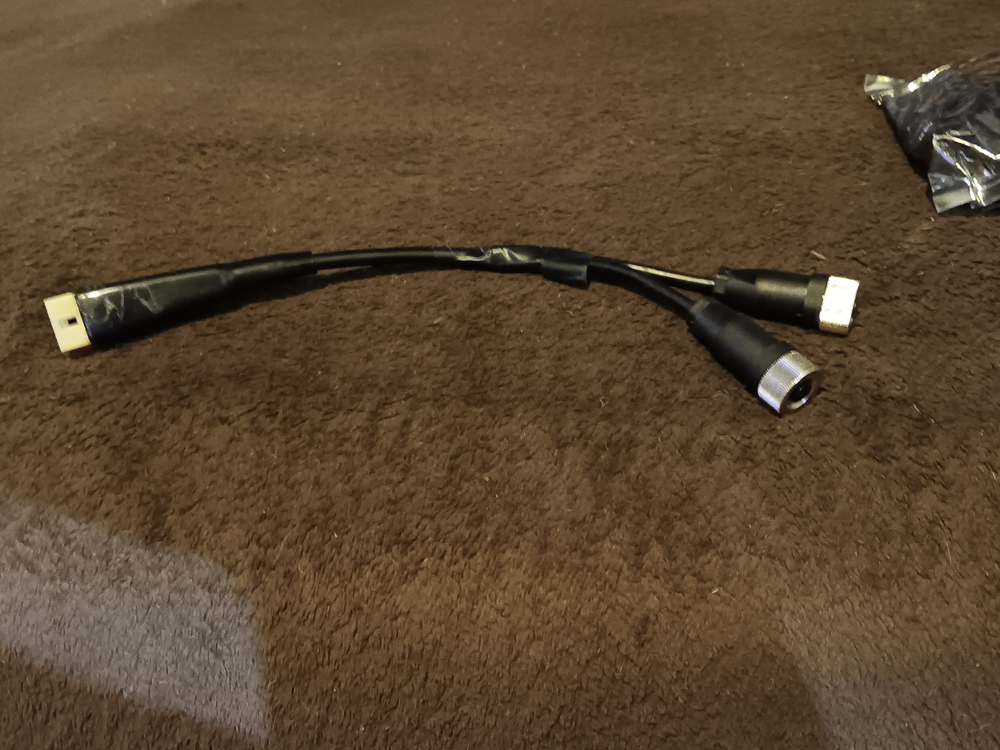

# Reusing OEM Intec Rear-View Cables for Modern AHD Camera Upgrades
**Vehicle Focus:** 1998 Holiday Rambler Endeavor (Freightliner Chassis)  
**Original System:** Intec CVM600 Monitor with OEM 12-Pin Cables  
**Target System:** Modern 1080p AHD Multiview (Greenyi Cameras, AHD Switcher)  
**Primary Source:** [Originally published on Facebook](https://facebook.com)

---

### 📋 Project Overview
Running a new 37-foot camera cable from the rear cap to the front dash of a diesel pusher is a notoriously difficult task. This guide documents how to repurpose the factory-installed gray-sheathed OEM Intec CVM system wiring harness to run up to three high-definition (1080p AHD) cameras, completely bypassing the need to fish new lines through the chassis.

   
  <em>Figure 1: The upgraded 1080p AHD color monitor mounted cleanly on the dash, replacing the original monochrome Intec CVM600 unit.</em>

---

### 🧰 Required Components & Materials
* **Cameras:** 3x Greenyi 1080p AHD Cameras (1x Right Side, 2x Rear for standard view and hitch view)
* **Monitor:** 9" Two-Channel 1080p AHD Monitor
* **Switcher:** 4-Channel 1080p AHD Video Switcher
* **Connectors:** 
  * 1x Set of **#1122 Molex 12-Pin (.062" terminal)** connectors (Sourced via Vetco Electronics)
  * GX12 4-Pin Aviation Connectors (Male and Female sets from Amazon)

  

---

### 🔍 Understanding the Factory Wiring Architecture
The original factory harness is a gray-sheathed bundle utilizing **#1122 Molex 12-pin connectors**. 
* **Front Access Point:** Male Molex connector located under the front dash.
* **Rear Access Point:** Female Molex connector located inside the bedroom cabinets directly above the bed (behind a 4-screw access panel).

  
   
  <em>Figure 2: Upper—Factory wiring 
    with front molex connector tucked under the dash. Lower—Square face of the 12-pin Molex female rear plug assembly.</em>

The cable bundle internally contains **three distinct shielded coaxial cables** and basic power conductors:
1. **Video Coax:** Clear outer sheath with a gray core (Used for primary rear view).
2. **Audio Coax (Parallel Pair):** Grayish/purple sheath and Yellow sheath.
3. **Power Conductors:** 1x Red wire (12V+ Positive) and 1x Black wire (Ground).

---

### ⚠️ Critical Step: Eliminating Video Ghosting
If you are only installing **one single rear camera**, you can use the clear-sheathed, gray-core coax without modifications. 

However, if you are configuring a **two-camera rear setup** (e.g., Backup + Hitch camera) using the audio lines, you must isolate the parallel lines to prevent signal cross-talk and image ghosting:

> 🚨 **CRITICAL MODIFICATION:** At the rear connector (on the cable side), locate the yellow and grayish/purple shielded coax cables. **Snip the two drain wires** from these cables. Next, **snip the purple coax core** going into the connector terminal, leaving **only the single yellow coax core** connected to the terminal. Failure to isolate these lines will cause immediate video ghosting on your hitch camera feed.

   
  <em>Figure 3: Close-up view of the internal coax cores and yellow/purple lines entering the back of the Molex connector.</em>

---

### 🔌 Pin Mapping & Custom Adapter Wiring
Instead of soldering difficult connections under the dash or cramped inside overhead cabinets, it is highly recommended to build custom **"Y-Adapters"** on your workbench. 

Split the single 12V positive (Red) and ground (Black) wires from the OEM bundle at both the front and rear adapters to feed both cameras.

  
   
  <em>Figure 4: Upper—Bench configuration  of front Y-adapter next to the legacy monitor. Lower—Completed custom workbench rear Y-adapter transitioning from Molex 12 pin to GX12 four pin.</em>

#### GX12 4-Pin Aviation Terminal Blueprint

| Pin Number | Assignment | Notes |
| :---: | :--- | :--- |
| **Terminal 1** | **12V + Positive** | Split from OEM Red wire |
| **Terminal 2** | **Ground (Negative)** | Split from OEM Black wire |
| **Terminal 3** | *Not Used* | Leave open |
| **Terminal 4** | **Video Signal** | Connected to corresponding Coax core |

#### Shielding & Grounding Best Practice
* **At the Front Dash:** Combine the newly added shield drain wire with the split camera system ground for each individual camera feed.
* **At the Rear Cap:** Float the shield grounds at the rear to prevent ground loops.

---

### 🏗️ Final System Configuration & Performance
On this specific overhaul, the 3-channel setup was split across the factory and supplemental lines:
* **Channel 1 (Rear Main View):** Routed through the OEM clear-sheathed coax.
* **Channel 2 (Hitch View):** Routed through the modified OEM yellow-sheathed parallel audio coax.
* **Channel 3 (Right Side Blindspot):** Routed via a standard 8-meter standalone Amazon video cable.

**Result:** The upgraded system displays zero interference, no static, and crystal-clear image definition across all three views simultaneously.

---
[← Back to Guides Hub](guides.md) | [Back to Profile](README.md)
